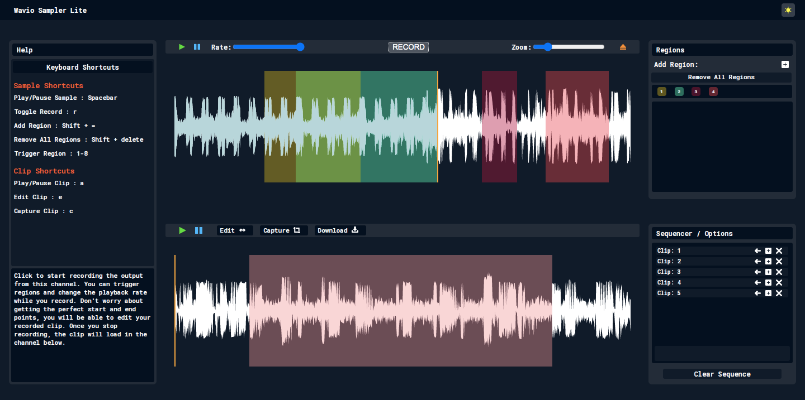

  
  <h1>Wavio Sampler Lite</h1>

In-browser audio sampler: create downloadable clips and sequences from samples of your choice.   

🌊  [https://waviosampler.netlify.app](https://waviosampler.netlify.app) 🌊

## Features

- 📂 Drag-n-drop audio file selection
- ↔️ Resizable/Draggable regions on Waveform
- 🎶 Record live playback while triggering regions
- 🎧 Build sequences from recorded clips
- 💾 Download clips and sequences

## Keyboard shortcuts
Keyboard shortcuts to help speed up your workflow. 

| Shortcut         | Description               |
| ---------------- | ------------------------- |
| `Spacebar`       | Play/Pause sample         |
| `r`              | Toggle record             |
| `shift + =`      | Add region                |
| `shift + delete` | Remove all regions        |
| `1-8`            | Trigger region playback   |
| `a`              | Play/Pause clip           |
| `e`              | Edit clip                 |
| `c  `            | Capture clip              |